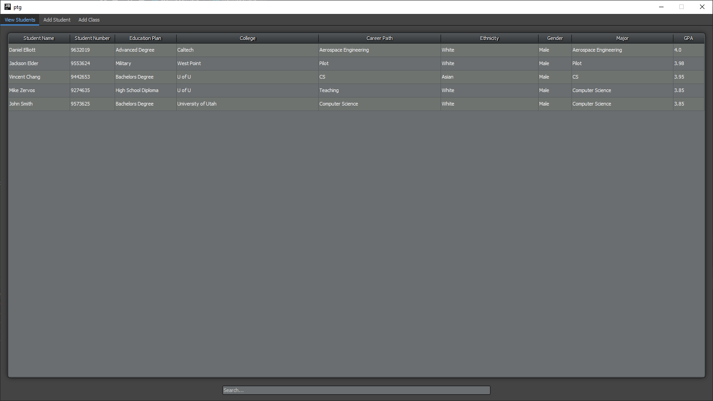
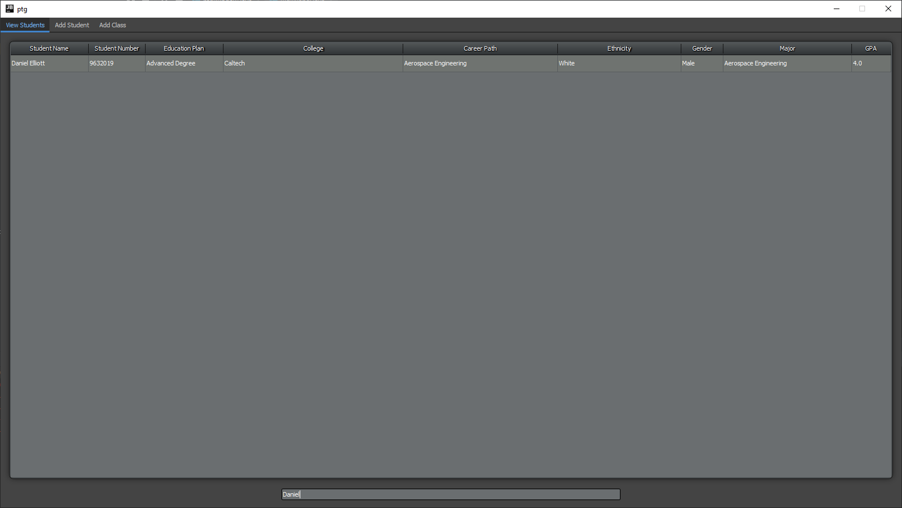
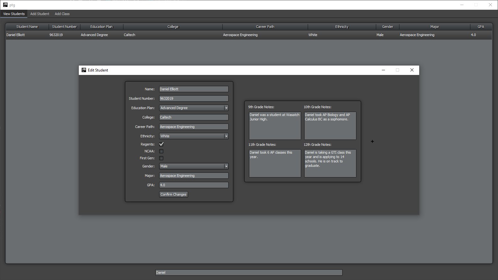
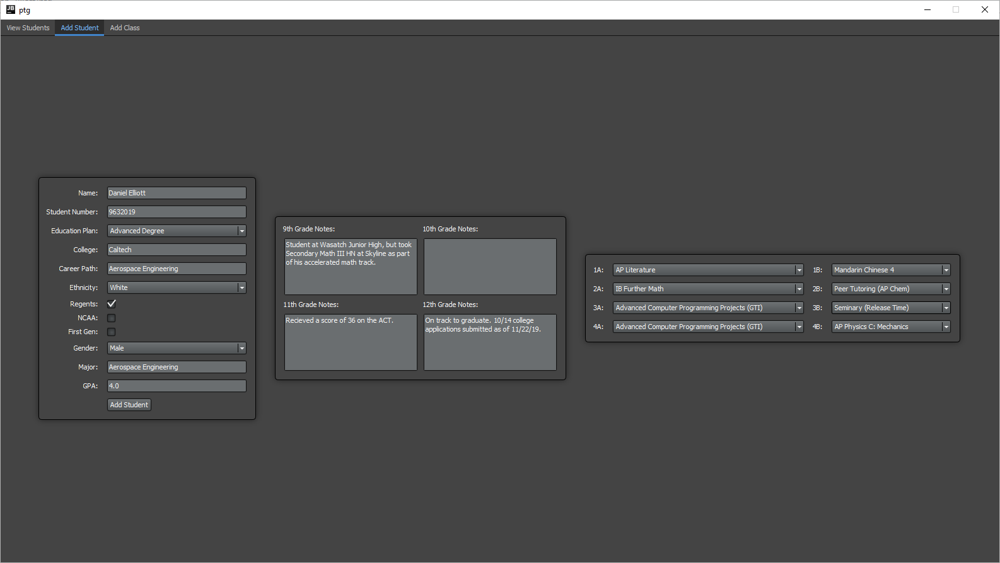
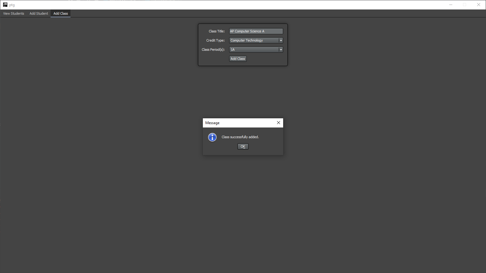

# ptg - Progress Towards Graduation (WIP)
## Viewing Students

Students can be viewed in a table under the "View Students" tab present at the top of the window.

The "Search" bar present at the bottom of the window can be used to search or filter students by name, student number, or any of the characteristics present in the table.

Students can also be "edited" by double clicking on them. If their GPA, desired major, or anything else changes, it can be edited within this window.

## Adding Students

Students can be added under the "Add Student" tab present at the top of the window.

## Classes

A student's scheduled classes reflect only the classes offered at that period. For example, if IB Further Math is only offered during period 2A, then the drop-down menu in front of "2A:" will be the only one that contains IB Further Math. Each class has a "credit type" assigned to it, which will be reflected in the student's "PTG Printout" implemented in the future. This will show which graduation requirements a student has met based on their credits earned or taken.

